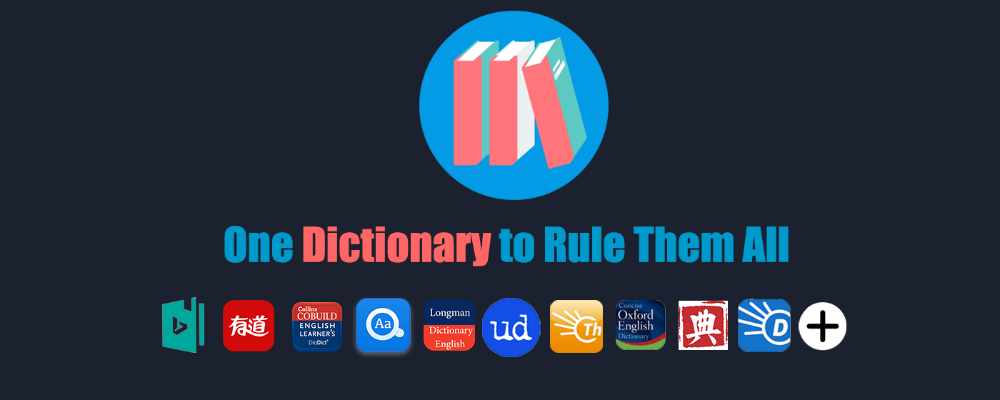
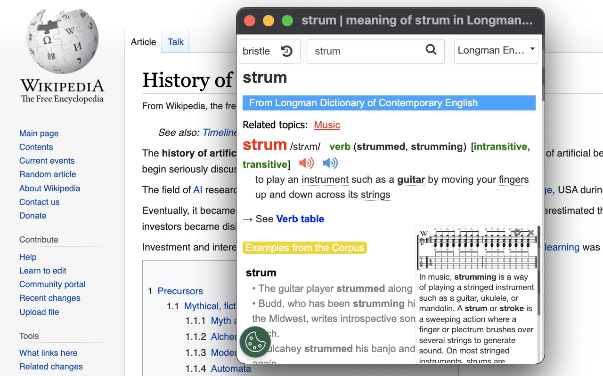
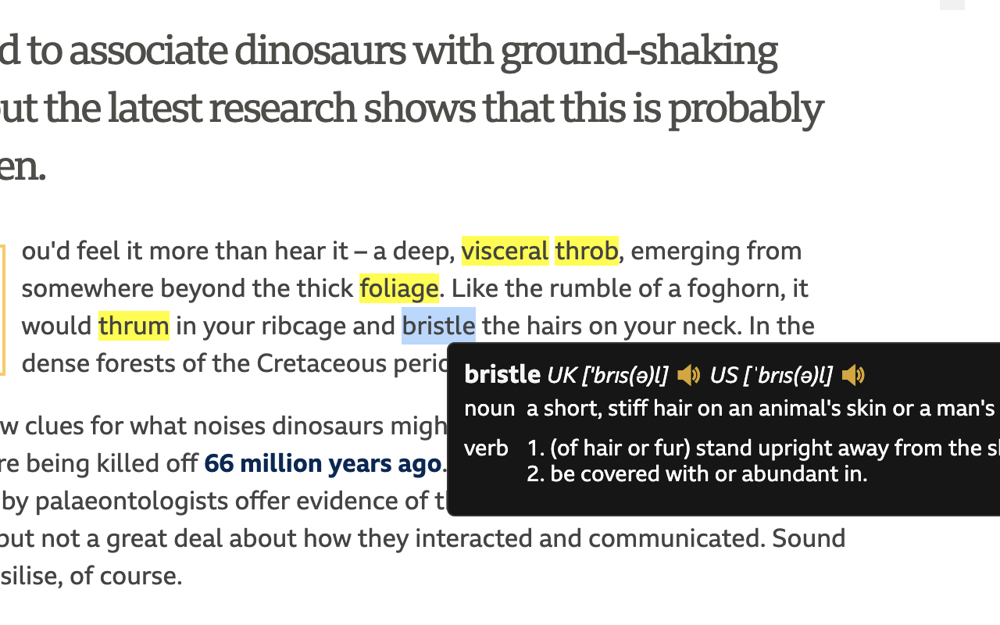
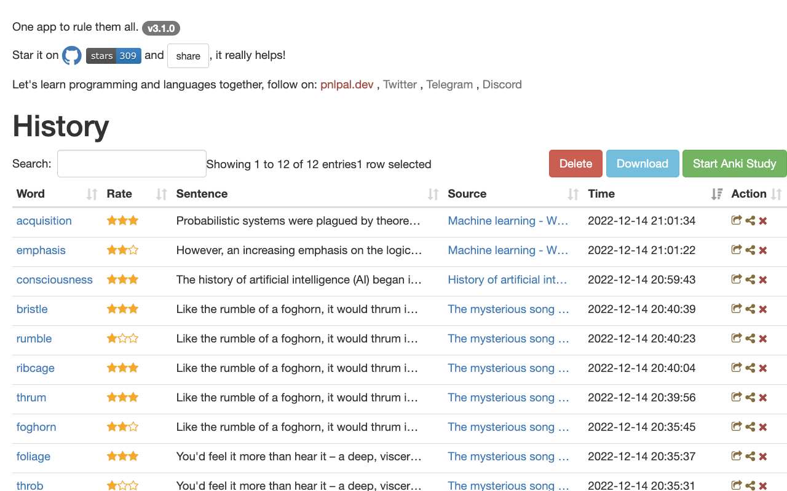
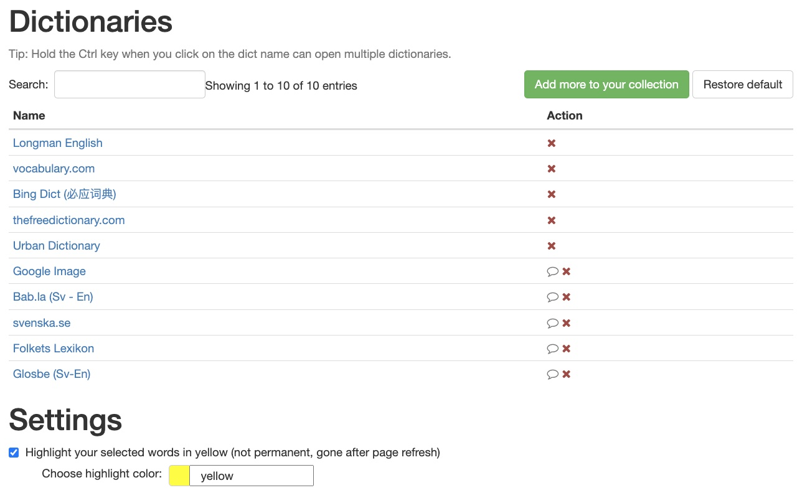

# Vpocket

A browser extension that helps you look up words in multiple dictionaries. With only one click, you can quickly find the definition, translation, and pronunciation of any word on any webpage, and also export the words you've looked up to **Anki**.

# Install

- [chrome web store](https://chrome.google.com/webstore/detail/dictionaries/diojcfpekhhnndfmggknljpnfpcccbhc)

# TL;DR

Welcome to Vpocket, the language learning extension available on Chrome, Firefox, and Edge, designed to enhance your language learning experience.

With Vpocket, you can simply double-click on any word to access its definition, which appears on the screen, making it the fastest way to look up words.

Vpocket offers a wide range of languages support, including English, Chinese, Japanese, Korean, German, Spanish, French, Italian, Portuguese, Swedish, Norwegian, Danish, Russian, and Tajik. If you need support for additional languages, you can request it on our [Programming and Language community].

Another way is to just click on the app's icon to access a popup window with various dictionaries to search through. This feature allows you to explore words in more depth, with additional features such as auto-completion, word history, keyboard shortcuts, and real human pronunciation to enhance your learning experience.

As a language learner myself, I understand the challenges of learning a new language. That's why my goal is to provide a universal tool that enables users to look up any word in any language. We need your feedback and suggestions to improve the app experience.

We look forward to hearing from you and helping you achieve your language learning goals with Vpocket.

# Screenshot

# More dictionaries are needed!

[See here.](https://pnlpal.dev/topic/52/help-more-dictionaries-are-needed)

# Build

1. use `yarn` or `npm install` to install requirements.
2. `npm start` to start a webpack dev-server, add the `build/` directory in your browser's extension page to load the extension.
3. `npm run build` to build the release code. The dest path is `build/`.

